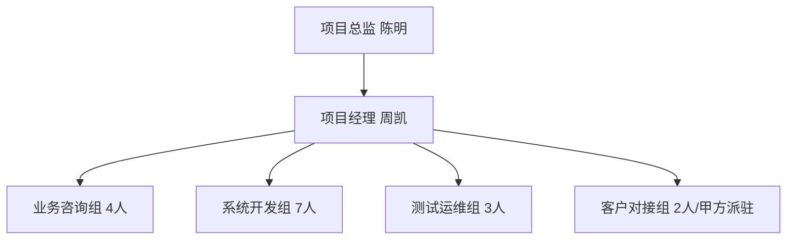

# [[浦发银行]][[财务共享中心]]项目人员清单
---
## 元信息
| 字段 | 内容 |
| --- | --- |
| 客户 | 上海浦东发展银行股份有限公司总行 |
| 项目名称 | [[浦发银行]][[财务共享中心]]一期建设项目 |
| 所属部门 | [[星辰数智]][[财务管理部]] |
| 编制人 | [[徐峰]]（[[财务管理部]]项目运营岗） |
| 编制日期 | 2024年5月14日 |
| 版本号 | V1.0 |
| 审批人 | 张莉（[[财务管理部]]总监） |
| 审批日期 | 2024年5月14日 |
| 适用周期 | 2024年5月15日-2025年1月20日 |
| 对应人力预算 | 128.6万元人民币 |

---
## 一、项目组架构
本项目采用「总监负责制+模块化分组」架构，总编制18人，其中我方派驻16人，甲方驻场2人，架构层级如下：

---
## 二、人员角色与职责
| 组别 | 姓名 | 岗位 | 入职/派驻日期 | 核心职责 |
| --- | --- | --- | --- | --- |
| [[项目管理]]组 | 陈明 | 项目总监 | 2018年3月12日（我方） | 对接浦发总行CFO办公室，把控项目整体方向、预算审批、重大风险协调，对项目[[交付]]结果负总责 |
| [[项目管理]]组 | 周凯 | 项目经理 | 2019年7月25日（我方） | 负责项目进度管控、资源调度、需求变更审核、每周项目例会输出，按期提交进度报告，项目全周期驻场 |
| 业务咨询组 | 刘敏 | 高级财务咨询顾问（组长） | 2017年9月3日（我方） | 负责[[财务共享中心]]业务流程重构，输出《业务需求说明书》，对接浦发12个财务业务岗完成需求确认，负责费用报销、核算、资金三大模块的业务规则设计 |
| 业务咨询组 | 王佳 | 财务咨询顾问 | 2021年4月19日（我方） | 负责费用报销模块需求梳理、场景验证，输出用户操作手册，配合完成用户培训 |
| 业务咨询组 | 赵宇 | 财务咨询顾问 | 2022年1月6日（我方） | 负责总账核算、[[报表]]模块需求梳理、规则校验，对接浦发税务部门完成涉税流程适配 |
| 业务咨询组 | 李萌 | 财务咨询顾问 | 2022年8月12日（我方） | 负责资金[[结算]]、银企直连模块需求梳理，对接浦发资金部完成支付链路测试 |
| 系统开发组 | 林浩 | 高级[[Java]]开发工程师（组长） | 2018年11月21日（我方） | 负责系统架构设计、核心代码开发、开发团队进度管控，对接甲方科技部完成技术标准对齐 |
| 系统开发组 | 黄涛 | [[前端]]开发工程师 | 2021年6月8日（我方） | 负责PC端、移动端操作界面开发，适配浦发全行统一UI规范 |
| 系统开发组 | 陈悦 | [[前端]]开发工程师 | 2022年3月17日（我方） | 负责[[报表]]可视化模块、[[审批流]]界面开发 |
| 系统开发组 | 吴凡 | [[后端]]开发工程师 | 2020年9月2日（我方） | 负责费用报销模块[[后端]]接口开发 |
| 系统开发组 | 郑强 | [[后端]]开发工程师 | 2021年10月11日（我方） | 负责核算、[[报表]]模块[[后端]]接口开发 |
| 系统开发组 | 孙宇 | [[后端]]开发工程师 | 2022年5月9日（我方） | 负责资金、银企直连模块[[后端]]接口开发 |
| 系统开发组 | 郭明 | 数据库工程师 | 2019年2月27日（我方） | 负责[[Oracle]][[数据库设计]]、性能优化、数据迁移方案制定 |
| 测试运维组 | 谢楠 | 高级测试工程师（组长） | 2020年7月14日（我方） | 负责测试环境搭建、测试用例设计、测试进度管控，累计完成不少于1200条用例的测试，输出正式测试报告 |
| 测试运维组 | 姚丽 | 测试工程师 | 2022年7月18日（我方） | 负责功能测试、兼容性测试，跟进bug修复进度 |
| 测试运维组 | 董浩 | 运维工程师 | 2021年12月3日（我方） | 负责[[上线]]部署、日常运维、应急故障处理，[[上线]]后提供3个月驻场运维支持 |
| 客户对接组 | 张雯 | 甲方项目负责人 | 2024年5月15日派驻 | [[浦发银行]][[财务共享中心]]副主任，负责甲方侧需求确认、资源协调、[[验收]]审批 |
| 客户对接组 | 刘强 | 甲方技术对接人 | 2024年5月15日派驻 | [[浦发银行]]科技部主管，负责甲方侧技术标准对齐、服务器资源申请、接口权限开通 |

---
## 三、人员技能矩阵
| 姓名 | 岗位 | 财务类资质 | 技术类资质 | 同类项目经验 |
| --- | --- | --- | --- | --- |
| 陈明 | 项目总监 | 注册会计师（CPA）、高级会计师 | PMP认证 | 6个银行类[[财务共享中心]]项目管控经验 |
| 周凯 | 项目经理 | 中级会计师 | PMP认证、软考高级（系统集成[[项目管理]]工程师） | 4个金融行业财务系统[[项目管理]]经验 |
| 刘敏 | 高级财务咨询顾问 | 注册会计师（CPA）、ACCA | SAP FICO模块认证 | 8年财务咨询经验，主导过5个大型企业[[财务共享]]项目需求设计 |
| 林浩 | 高级[[Java]]开发工程师 | 无 | 软考高级（系统架构设计师）、[[Oracle]] OCP认证 | 5年金融行业系统开发经验，主导过3个财务系统架构设计 |
| 谢楠 | 高级测试工程师 | 初级会计师 | ISTQB测试认证 | 4年金融系统测试经验，累计输出测试用例超8000条 |
| 其他基层人员 | 各岗位 | 其中3人持有初级会计师资质 | 2人持有软考中级资质，所有开发人员均持有[[Java]]/[[Python]]相关技能认证 | 平均拥有2个以上金融类IT项目实施经验 |

---
## 四、人员投入比例
| 姓名 | 岗位 | 投入时段 | 周投入时长 | 投入占比 | 人天单价（元） |
| --- | --- | --- | --- | --- | --- |
| 陈明 | 项目总监 | 2024.5.15-2025.1.20 | 8小时 | 20% | 3200 |
| 周凯 | 项目经理 | 2024.5.15-2025.1.20 | 40小时 | 100% | 2400 |
| 刘敏 | 高级咨询顾问 | 2024.5.15-2024.9.30 | 40小时 | 100% | 2800 |
| 王佳/赵宇/李萌 | 咨询顾问 | 2024.5.15-2024.10.31 | 40小时 | 100% | 1800 |
| 林浩 | 开发组长 | 2024.6.15-2024.12.15 | 40小时 | 100% | 2600 |
| 黄涛/陈悦/吴凡/郑强/孙宇 | 开发工程师 | 2024.6.15-2024.12.15 | 40小时 | 100% | 1600 |
| 郭明 | 数据库工程师 | 2024.6.15-2024.12.31 | 20小时 | 50% | 2200 |
| 谢楠 | 测试组长 | 2024.10.1-2024.12.31 | 40小时 | 100% | 2000 |
| 姚丽 | 测试工程师 | 2024.10.1-2024.12.31 | 40小时 | 100% | 1400 |
| 董浩 | 运维工程师 | 2024.12.1-2025.1.20 | 40小时 | 100% | 1500 |
| 张雯/刘强 | 甲方对接人 | 2024.5.15-2025.1.20 | 20小时 | 50% | 甲方自理 |

---
## 五、联系方式
| 姓名 | 岗位 | 办公电话 | [[企业微信]]ID | 工作邮箱 |
| --- | --- | --- | --- | --- |
| 陈明 | 项目总监 | 021-88667799 | chenming_xc | chenming@starintell.com |
| 周凯 | 项目经理 | 021-88667788 | zhoukai_xc | zhoukai@starintell.com |
| 刘敏 | 咨询组长 | 021-88667787 | liumin_xc | liumin@starintell.com |
| 林浩 | 开发组长 | 021-88667786 | linhao_xc | linhao@starintell.com |
| 谢楠 | 测试组长 | 021-88667785 | xienan_xc | xienan@starintell.com |
| 张雯 | 甲方负责人 | 021-28886666 | zhangwen_spdb | zhangwen@spdb.com.cn |
| 刘强 | 甲方技术对接 | 021-28886667 | liuqiang_spdb | liuqiang@spdb.com.cn |

---
## 六、紧急联系人
| 优先级 | 联系人 | 岗位 | 联系电话 | 负责场景 | 响应时效 |
| --- | --- | --- | --- | --- | --- |
| 一级 | 周凯 | 项目经理 | 138XXXX1234 | 日常需求变更、现场故障、进度延误等常规突发问题 | 15分钟内响应 |
| 二级 | 张莉 | [[财务管理部]]总监 | 135XXXX6789 | 重大客户投诉、预算超支、核心人员离职等需公司层面协调的问题 | 30分钟内响应 |
| 三级 | 张雯 | 甲方项目负责人 | 139XXXX4567 | 甲方侧流程审批、资源协调、重大需求变更确认 | 1小时内响应 |

---
## 变更记录
| 版本号 | 变更日期 | 变更人 | 变更内容 |
| --- | --- | --- | --- |
| V1.0 | 2024.5.14 | [[徐峰]] | 初始版本发布，全项目人员清单确认 |
| 后续变更将按实际人员调整情况实时更新，版本号按V1.1/V1.2规则升序 |